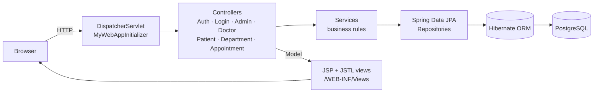
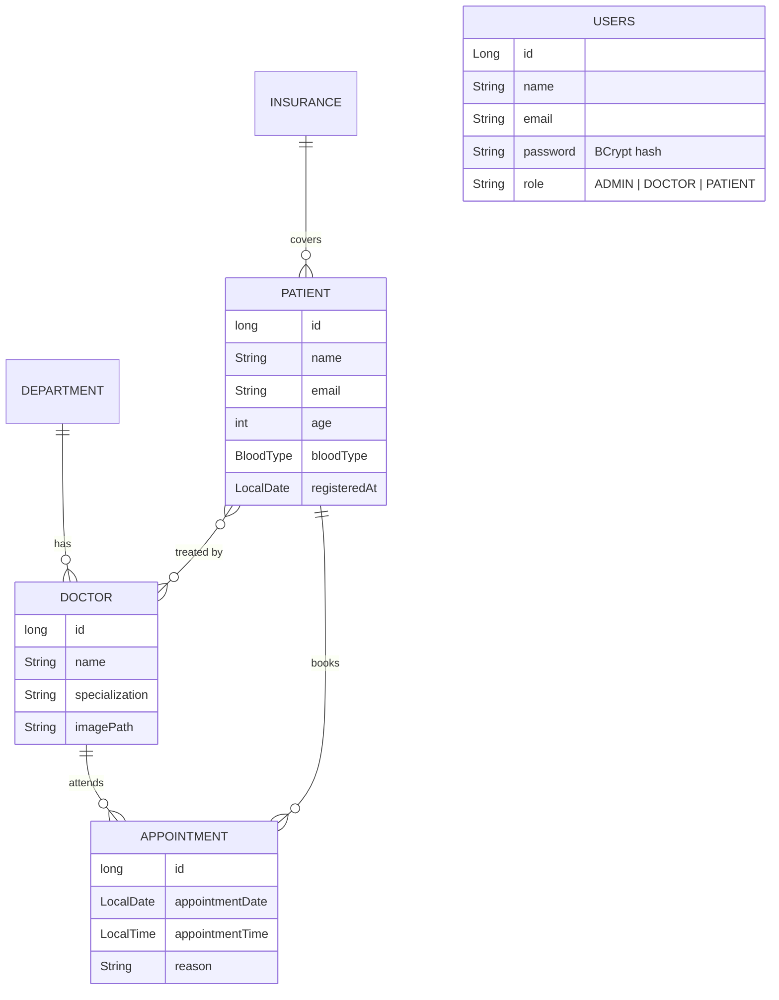

<div align="center">

# 🏥 Hospital Management System

**A multi-role hospital web application built with Spring MVC, Hibernate ORM, JSP and PostgreSQL**


</div>

---

## 📌 Overview

Hospital Management System digitises the day-to-day work of a hospital: managing departments, doctors and patients, and letting patients book and track appointments online. It is a classic **layered MVC application** (Controller → Service → Repository → Entity) running on Spring MVC with a pure Java configuration (no `web.xml`), Hibernate/JPA for persistence and JSP views rendered on Apache Tomcat.

## ✨ Features

| Role | What they can do |
|------|------------------|
| 🛡️ **Admin** | Dashboard, full CRUD on **departments**, **doctors** (with profile photo upload) and **patients**, patient search |
| 🩺 **Doctor** | Personal dashboard with their assigned appointments |
| 🧑 **Patient** | Self-registration, dashboard, **book appointments** with a doctor, view and cancel own appointments |

**Under the hood**

- 🔐 **Session-based authentication** with passwords hashed using **BCrypt**
- 👮 **Role-based authorization** – every protected page checks the logged-in user's role and redirects otherwise
- 🗂️ **Spring Data JPA repositories** on top of Hibernate with relational mapping (One-to-Many, Many-to-One, Many-to-Many)
- 🖼️ **Image upload** for doctor profile photos via `MultipartFile`, served through a static resource handler
- 🔎 **Search** for patients, flash-style success messages and input checks on booking
- 🎨 Responsive **Bootstrap** UI with **JSTL**-driven JSP views

## 🏗️ Architecture



## 🧬 Domain Model



## 🧰 Tech Stack

| Layer | Technology |
|-------|------------|
| Language | Java 17 |
| Web | Spring MVC 5.3 (Java config), Servlet 4 |
| Persistence | Spring Data JPA, Hibernate ORM 5.6, HikariCP |
| Database | PostgreSQL |
| Security | Spring Security Crypto (BCrypt), HttpSession |
| View | JSP, JSTL, Bootstrap |
| Build / Server | Maven (WAR packaging), Apache Tomcat 9 |

## 📂 Project Structure

```
src/main/java/org/app
├── config/          # MyConfig (MVC, JPA, DataSource, BCrypt, multipart) + MyWebAppInitializer
├── Controllers/     # Auth, Login, Home, Admin, Doctor, Patient, Department, Appointment
├── Services/        # User, Doctor, Patient, Department, Appointment services
├── Repositories/    # Spring Data JPA repositories
├── models/          # JPA entities: User, Doctor, Patient, Department, Appointment, Insurance
├── dto/             # RegisterDto
└── Enums/           # BloodType
src/main/webapp/WEB-INF/Views   # JSP pages (dashboards, lists, forms)
```

## 🛣️ Main Routes

| Method | Path | Access | Description |
|--------|------|--------|-------------|
| GET/POST | `/login`, `/register` | Public | Sign in / patient sign-up |
| GET | `/logout` | Logged in | End session |
| GET | `/admin/dashboard` | Admin | Admin overview |
| GET · POST | `/departments`, `/departments/save`, `/departments/delete/{id}` | Admin | Manage departments |
| GET · POST | `/doctors`, `/doctors/save`, `/doctors/update`, `/doctors/{id}`, `/doctors/delete/{id}` | Admin | Manage doctors |
| GET | `/doctors/dashboard` | Doctor | Doctor's appointments |
| GET · POST | `/patients`, `/patients/save`, `/patients/update`, `/patients/{id}`, `/patients/search` | Admin | Manage patients |
| GET | `/patient/dashboard` | Patient | Patient overview |
| GET · POST | `/appointments/book`, `/appointments/save` | Patient | Book an appointment |
| GET | `/appointments/my`, `/appointments/delete/{id}` | Patient | View / cancel appointments |

## 🚀 Getting Started

### Prerequisites

- JDK 17+
- Maven 3.8+
- PostgreSQL 13+
- Apache Tomcat 9 (or the SmartTomcat plugin in IntelliJ IDEA)

### 1. Create the database

```sql
CREATE DATABASE hospitalsystem;
```

### 2. Configure the connection

Update the datasource in `src/main/java/org/app/config/MyConfig.java` with your PostgreSQL URL, username and password. Tables are created automatically (`hibernate.hbm2ddl.auto=update`).

### 3. Build and deploy

```bash
git clone https://github.com/amantiwarie/HospitalManagmentSystem.git
cd HospitalManagmentSystem
mvn clean package
```

Copy `target/HospitalManagementSystem.war` into Tomcat's `webapps/` folder and start Tomcat, then open `http://localhost:8080/HospitalManagementSystem/`.

### 4. First login

Register as a patient from `/register`. To use the admin panel, set `role = 'ADMIN'` for a user in the `users` table.

## 🗺️ Roadmap

- [ ] Move DB credentials to environment variables
- [ ] Migrate to Spring Boot + Spring Security with CSRF protection
- [ ] Dockerfile and Jenkins CI/CD pipeline
- [ ] Email notifications for booked appointments

## 👤 Author

**Aman Tiwari** – Associate Software Engineer | Java Full Stack Developer

[](https://linkedin.com/in/amantiwarie)
[](https://github.com/amantiwarie)
[](mailto:attiwari261@gmail.com)

⭐ If you found this project useful, consider giving it a star!
